# Quraaa Architecture Overview

**Purpose**

This document defines the complete architecture of the Quraaa mobile application. It is the canonical reference for every developer joining the project. After reading this document, you should understand how the codebase is organized, why it is organized that way, and how data flows from the user interface down to the database and back. No source code reading is required to grasp the concepts.

---

## Overview

Quraaa is built as a **Feature-First Clean Architecture** application using **Flutter**, **MVVM**, and **BLoC** for state management. The architecture is designed to be:

- **Modular** — Each feature is a self-contained unit that can be developed, tested, and deployed independently.
- **Scalable** — New features can be added without modifying existing code.
- **Testable** — Business logic is decoupled from the UI framework, making it easy to unit test.
- **Maintainable** — Clear separation of concerns makes the codebase predictable and reduces cognitive load.
- **Offline-First** — The app works without a network connection and synchronizes when connectivity returns.

The architecture enforces strict dependency rules and follows SOLID principles, DRY, KISS, and YAGNI. It treats the mobile app as a client in a distributed system, responsible for its own state, caching, and offline behavior.

---

## Architecture Goals

| Goal | Description | Why It Matters |
|------|-------------|--------------|
| **Feature Isolation** | Every feature is a sealed module with its own layers. | Prevents merge conflicts, reduces side effects, and enables parallel development. |
| **Testability at Scale** | All business logic lives in pure Dart classes with no Flutter dependencies. | Unit tests run in milliseconds without needing `flutter_test` or widget trees. |
| **Framework Independence** | The domain layer knows nothing about Flutter, Dio, Drift, or GoRouter. | If we ever switch to a different UI framework or HTTP library, the domain layer remains untouched. |
| **Offline-First** | Local data is the source of truth; the network is a secondary layer. | Users in regions with poor connectivity still have a full experience. |
| **Type Safety** | Every data shape is modeled with strongly typed classes. | Compile-time errors instead of runtime crashes. |
| **Observable State** | All state changes are predictable and traceable. | Debugging is deterministic; reproducing bugs is trivial. |
| **Consistent Error Handling** | Errors are modeled as values, not exceptions. | No hidden crash paths; every failure is handled explicitly. |

---

## Why Clean Architecture

Clean Architecture, as defined by Robert C. Martin, organizes code into concentric layers. The inner layers contain the most stable, high-level business logic. The outer layers contain unstable, low-level framework details.

### The Problem with Traditional Layered Architecture

In a traditional MVC or simple layered architecture, the controller often directly calls the database. Over time, business logic leaks into the UI, database queries become entangled with presentation concerns, and testing requires spinning up the entire application stack.

### How Clean Architecture Solves It

Clean Architecture introduces a **Domain Layer** that sits at the center. It contains:

- **Entities** — Pure business objects (e.g., `Book`, `User`, `ReadingSession`).
- **Use Cases** — Single-responsibility classes that encapsulate one business operation (e.g., `GetBookDetailsUseCase`, `PurchaseEbookUseCase`).
- **Repository Interfaces** — Abstract contracts that define what data operations are possible, without specifying how they are implemented.

The Domain Layer has **zero dependencies** on Flutter, Dio, Drift, or any external library. It is pure Dart.

### Layered Architecture in Quraaa

Quraaa implements four layers:

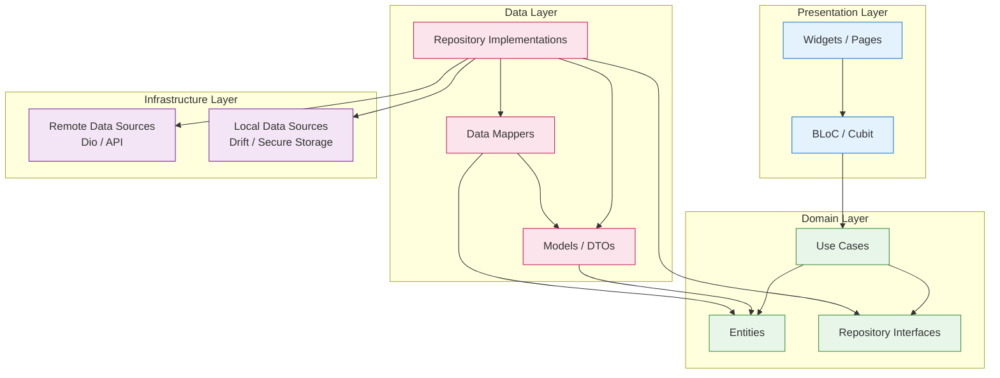

| Layer | Responsibility | Example |
|-------|---------------|---------|
| **Presentation** | Render UI, handle user input, observe state. | `BookDetailPage`, `BookDetailBloc` |
| **Domain** | Define business logic, rules, and data contracts. | `GetBookDetailsUseCase`, `Book` entity, `IBookRepository` |
| **Data** | Implement data contracts, transform DTOs to entities. | `BookRepositoryImpl`, `BookModel`, `BookMapper` |
| **Infrastructure** | Talk to the outside world: HTTP, database, secure storage. | `BookRemoteDataSource`, `BookLocalDataSource` |

---

## Why Feature First

There are two common ways to organize a Flutter project: **Layer-First** and **Feature-First**.

### Layer-First Organization

```
lib/
  data/
    repositories/
    models/
    datasources/
  domain/
    entities/
    usecases/
    repositories/
  presentation/
    blocs/
    pages/
    widgets/
```

In a Layer-First structure, all repositories live in `data/repositories/`, all use cases in `domain/usecases/`, and all pages in `presentation/pages/`. This seems clean at first, but as the project grows, it becomes a nightmare:

- A developer working on the **Reader** feature must navigate four different directories to find related files.
- Refactoring a feature requires touching files scattered across the entire project.
- It is impossible to know which files belong to which feature without memorizing the codebase.
- Merge conflicts are frequent because multiple developers edit the same directories.

### Feature-First Organization

```
lib/
  features/
    reader/
      data/
      domain/
      presentation/
    marketplace/
      data/
      domain/
      presentation/
    library/
      data/
      domain/
      presentation/
```

In a Feature-First structure, every feature is a self-contained module with its own layers. The benefits are immediate:

| Benefit | Explanation |
|---------|-------------|
| **Locality** | Every file related to a feature lives in one directory. A developer can work entirely within `features/reader/` without touching any other code. |
| **Encapsulation** | Features expose only what they choose to. Internal classes are hidden. Other features cannot import into `features/reader/data/` directly. |
| **Parallel Development** | Two developers can work on `reader` and `marketplace` simultaneously without merge conflicts. |
| **Code Discovery** | New developers can see the full scope of a feature by listing one directory. |
| **Testability** | A feature's test suite can run in isolation. |
| **Deletion Safety** | Removing a feature is as simple as deleting its directory. No orphaned files remain. |

### Cross-Feature Communication

Features should not import each other's internal layers. If `reader` needs to navigate to `marketplace`, it does so through:

- **GoRouter named routes** (e.g., `/marketplace/book/:id`).
- **Shared entities** in `core/shared/` for truly global models.
- **Events** published through a lightweight event bus for loosely coupled communication.

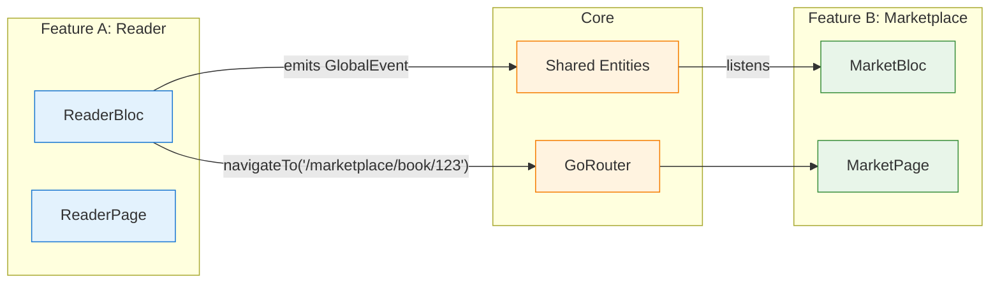

---

## MVVM Responsibilities

Quraaa uses a variation of **Model-View-ViewModel (MVVM)** adapted for Flutter and BLoC.

| Component | Responsibility | Quraaa Implementation |
|-----------|---------------|----------------------|
| **Model** | Data and business logic. | Domain entities (`Book`, `User`) and use cases (`GetBookUseCase`). |
| **View** | What the user sees and interacts with. | Flutter widgets and pages (`BookDetailPage`, `ReaderPage`). |
| **ViewModel** | Mediates between View and Model; exposes state. | BLoC / Cubit (`BookDetailBloc`, `ReaderCubit`). |

### The BLoC as ViewModel

In Quraaa, the BLoC (or Cubit) acts as the ViewModel. It:

1. **Receives user events** from the UI (e.g., `BookDetailOpened`, `PageScrolled`).
2. **Delegates to use cases** to perform business operations.
3. **Emits new states** that the UI observes and rebuilds from.
4. **Manages side effects** like navigation, snackbars, or dialogs via a `Stream` of UI events.

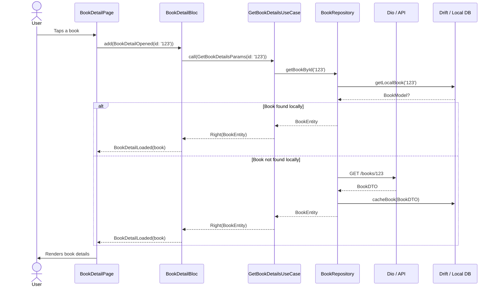

---

## Data Flow

Data in Quraaa flows in a single direction: **UI → BLoC → Use Case → Repository → Data Source → External System**. The response flows back through the same layers in reverse.

### Read Flow (with local cache)

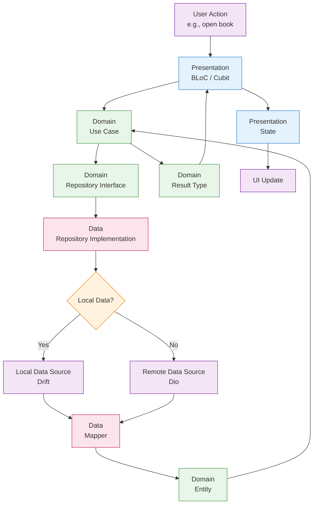

### Write Flow (with sync)

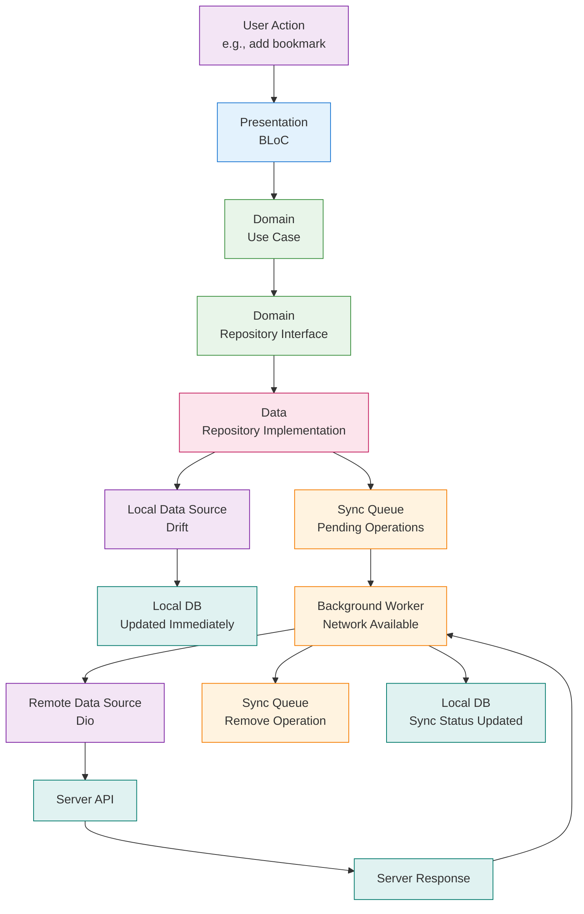

### Key Points

1. **The UI never talks directly to a repository.** It always goes through the BLoC and then a use case.
2. **The use case never knows about Dio or Drift.** It only knows about repository interfaces.
3. **The repository decides where data comes from.** It may check local first, remote first, or both.
4. **All data crossing layer boundaries is strongly typed.** DTOs become entities via mappers.

---

## Dependency Rule

The Dependency Rule is the most important constraint in Clean Architecture.

> **Source code dependencies can only point inward.** Nothing in an inner layer can depend on anything in an outer layer.

### Dependency Direction

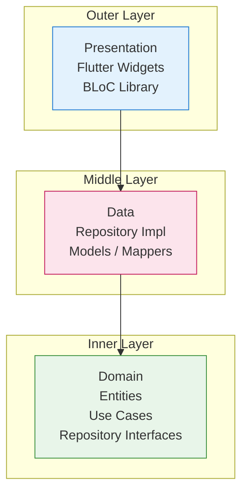

### What This Means in Practice

| Layer | Can Import From | Cannot Import From |
|-------|-----------------|-------------------|
| **Domain** | Dart standard library only | Flutter, Dio, Drift, GetIt, GoRouter, any third-party package |
| **Data** | Domain layer, Dart stdlib | Flutter widgets, BLoC, GoRouter |
| **Presentation** | Domain, Data, Core, Flutter, any package | Nothing is forbidden here (it's the outermost layer) |
| **Core** | Anything | Nothing is forbidden (it's a shared infrastructure layer) |

### Enforcing the Rule

We enforce this rule through:

1. **Code review** — Every PR is checked for illegal imports.
2. **Lint rules** — Custom import_lint rules can detect cross-layer violations.
3. **Directory structure** — The physical layout makes violations obvious.
4. **Abstract interfaces** — The domain layer defines `abstract class` repositories, not concrete implementations.

### Violation Example

```dart
// ❌ WRONG: Domain layer importing Flutter
import 'package:flutter/material.dart';

class Book extends ChangeNotifier {  // Never do this
  // ...
}
```

```dart
// ✅ CORRECT: Pure Dart entity
class Book extends Equatable {
  final String id;
  final String title;
  final String author;
  
  const Book({required this.id, required this.title, required this.author});
  
  @override
  List<Object?> get props => [id, title, author];
}
```

---

## SOLID Principles

Quraaa applies SOLID principles at every layer.

### Single Responsibility Principle (SRP)

Every class has one reason to change.

| Class Type | Responsibility |
|------------|----------------|
| `GetBookDetailsUseCase` | Fetch a single book by ID. |
| `BookRepository` | Coordinate between local and remote data for books. |
| `BookRemoteDataSource` | Perform HTTP requests for book endpoints. |
| `BookMapper` | Convert `BookModel` to `BookEntity` and vice versa. |
| `BookDetailBloc` | Manage the state of the book detail screen. |

### Open/Closed Principle (OCP)

Classes are open for extension but closed for modification.

```dart
// ✅ CORRECT: New behavior via composition, not modification
abstract class BookRepository {
  Future<Result<Book, Failure>> getBookById(String id);
}

class BookRepositoryImpl implements BookRepository {
  BookRepositoryImpl({
    required this.remoteDataSource,
    required this.localDataSource,
    required this.networkInfo,
  });
  
  // ... implementation
}

// If we need a cached version, we wrap it:
class CachedBookRepository implements BookRepository {
  CachedBookRepository(this._delegate);
  final BookRepository _delegate;
  
  @override
  Future<Result<Book, Failure>> getBookById(String id) async {
    // Add caching logic, then delegate
    return _delegate.getBookById(id);
  }
}
```

### Liskov Substitution Principle (LSP)

Any implementation of a repository interface can be substituted without breaking the use case.

```dart
// BookRepositoryImpl and MockBookRepository are interchangeable
final repository = kReleaseMode 
  ? BookRepositoryImpl(...) 
  : MockBookRepository();

// The use case doesn't care which one it gets
final book = await getBookDetailsUseCase.call(id);
```

### Interface Segregation Principle (ISP)

Repository interfaces are small and focused.

```dart
// ✅ CORRECT: Split by concern
abstract class ReadableBookRepository {
  Future<Result<Book, Failure>> getBookById(String id);
  Future<Result<List<Book>, Failure>> getBooksByCategory(String category);
}

abstract class WritableBookRepository {
  Future<Result<void, Failure>> saveBookmark(Bookmark bookmark);
  Future<Result<void, Failure>> updateReadingProgress(String bookId, double progress);
}

// A feature can depend on only what it needs
class ReaderBloc {
  ReaderBloc({
    required this.readableRepository,
    required this.writableRepository,
  });
}
```

### Dependency Inversion Principle (DIP)

High-level modules (use cases) depend on abstractions (repository interfaces), not low-level modules (Dio, Drift).

```dart
// ✅ CORRECT: Use case depends on interface
class GetBookDetailsUseCase {
  GetBookDetailsUseCase(this.repository);
  final BookRepository repository;  // Abstract, not concrete
  
  Future<Result<Book, Failure>> call(String id) => repository.getBookById(id);
}
```

---

## Repository Pattern

The Repository Pattern abstracts the data layer. The rest of the app does not know where data comes from or how it is persisted.

### Repository Responsibilities

A repository in Quraaa:

1. **Decides the data source** — local, remote, or both.
2. **Handles synchronization** — writes to local immediately, queues remote writes.
3. **Maps data** — converts DTOs to entities before returning.
4. **Handles errors** — catches exceptions and returns typed failures.
5. **Manages caching policy** — determines when to invalidate or refresh cache.

### Repository Structure

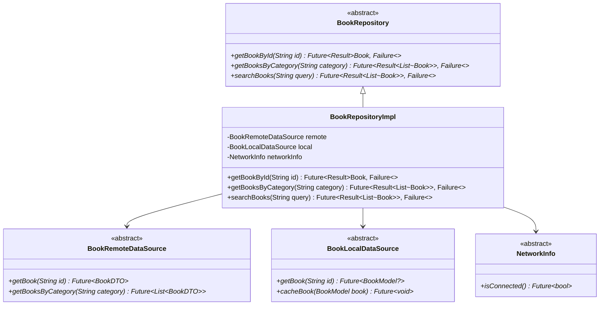

### Repository Decision Matrix

| Operation | Online | Offline | Strategy |
|-----------|--------|---------|----------|
| Read book | Yes | Yes | Return local immediately; refresh from remote in background if stale. |
| Read book | No | Yes | Return local only; queue refresh for when online. |
| Write bookmark | Yes | Yes | Write local immediately; sync to remote. |
| Write bookmark | No | Yes | Write local only; queue for sync. |
| Search | Yes | Yes | Search remote; cache results locally. |
| Search | No | Yes | Search local cache only; show stale data warning. |
| Purchase | Yes | Yes | Remote only; local is updated after confirmation. |
| Purchase | No | Yes | Block operation; inform user of offline status. |

---

## UseCase Pattern

A UseCase is a single class that encapsulates one specific business operation. It is the boundary between the presentation layer and the domain layer.

### Anatomy of a UseCase

```dart
abstract class UseCase<Type, Params> {
  Future<Type> call(Params params);
}

class GetBookDetailsUseCase extends UseCase<Result<Book, Failure>, GetBookDetailsParams> {
  GetBookDetailsUseCase(this.repository);
  final BookRepository repository;
  
  @override
  Future<Result<Book, Failure>> call(GetBookDetailsParams params) {
    return repository.getBookById(params.id);
  }
}

class GetBookDetailsParams {
  const GetBookDetailsParams({required this.id});
  final String id;
}
```

### Why UseCases Matter

| Benefit | Explanation |
|---------|-------------|
| **Single Responsibility** | Each class does exactly one thing. |
| **Reusability** | The same use case can be called from a BLoC, a background task, or a test. |
| **Testability** | Testing a use case requires only mocking the repository interface. |
| **Naming as Documentation** | `GetBookDetailsUseCase` is self-documenting. |
| **Parameter Objects** | `Params` classes make it easy to add optional fields without breaking signatures. |

### UseCase Naming Convention

| Pattern | Example | When to Use |
|---------|---------|-------------|
| `GetXUseCase` | `GetBookDetailsUseCase` | Retrieve a single resource. |
| `GetXListUseCase` | `GetBooksByCategoryUseCase` | Retrieve a list of resources. |
| `SearchXUseCase` | `SearchBooksUseCase` | Search with query parameters. |
| `CreateXUseCase` | `CreateBookmarkUseCase` | Insert a new resource. |
| `UpdateXUseCase` | `UpdateReadingProgressUseCase` | Modify an existing resource. |
| `DeleteXUseCase` | `DeleteNoteUseCase` | Remove a resource. |
| `SyncXUseCase` | `SyncLibraryUseCase` | Synchronize local and remote data. |
| `ValidateXUseCase` | `ValidateCouponCodeUseCase` | Validate input without side effects. |

---

## Folder Relationships

The full folder structure and the rules governing cross-feature imports.

### Project Root

```
lib/
├── main.dart                    # Entry point, initializes DI and app
├── app.dart                     # QuraaaApp widget, MaterialApp configuration
├── config/                      # Global configuration (routes, themes, env)
│   ├── router.dart              # GoRouter configuration
│   ├── theme.dart               # Light / dark theme definitions
│   └── env.dart                 # Envied environment variables
├── core/                        # Shared, framework-level code
│   ├── constants/               # App constants, API endpoints, keys
│   ├── dependency_injection/    # GetIt service locator setup
│   ├── errors/                  # Failure classes, exception handling
│   ├── network/                 # Dio configuration, interceptors, API client
│   ├── local_storage/           # Drift database setup, shared queries
│   ├── shared_widgets/          # Reusable UI components used across features
│   ├── utils/                   # Extensions, helpers, formatters
│   └── shared/                  # Truly shared entities and interfaces
├── features/                    # All feature modules
│   ├── authentication/
│   ├── home/
│   ├── reader/
│   ├── library/
│   ├── marketplace/
│   ├── author/
│   ├── community/
│   ├── notifications/
│   ├── profile/
│   ├── settings/
│   ├── subscription/
│   ├── achievements/
│   ├── audiobook/
│   └── ai_assistant/
└── l10n/                        # Localization files (Easy Localization)
```

### Feature Internal Structure

Every feature follows the same internal layout:

```
features/reader/
├── data/
│   ├── models/
│   │   ├── book_model.dart
│   │   ├── bookmark_model.dart
│   │   └── reading_progress_model.dart
│   ├── datasources/
│   │   ├── book_remote_data_source.dart
│   │   ├── book_local_data_source.dart
│   │   └── book_remote_data_source_impl.dart
│   ├── repositories/
│   │   └── book_repository_impl.dart
│   └── mappers/
│       ├── book_mapper.dart
│       └── bookmark_mapper.dart
├── domain/
│   ├── entities/
│   │   ├── book.dart
│   │   ├── bookmark.dart
│   │   └── reading_progress.dart
│   ├── repositories/
│   │   └── book_repository.dart
│   ├── usecases/
│   │   ├── get_book_details.dart
│   │   ├── save_bookmark.dart
│   │   └── update_reading_progress.dart
│   └── params/
│       ├── get_book_details_params.dart
│       └── save_bookmark_params.dart
└── presentation/
    ├── bloc/
    │   ├── reader_bloc.dart
    │   ├── reader_event.dart
    │   └── reader_state.dart
    ├── pages/
    │   ├── reader_page.dart
    │   └── reader_settings_page.dart
    ├── widgets/
    │   ├── book_page_view.dart
    │   ├── bookmark_bar.dart
    │   └── progress_indicator.dart
    └── viewmodels/
        └── reader_view_model.dart
```

### Import Rules

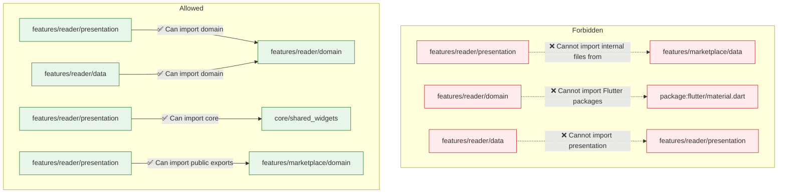

| Rule | Description | Example |
|------|-------------|---------|
| **Feature Isolation** | A feature cannot import another feature's internal folders. | `reader` cannot import `marketplace/data/models/`. |
| **Domain Purity** | Domain layer cannot import any framework or package. | `domain/` uses only Dart standard library. |
| **Data Purity** | Data layer cannot import presentation. | `data/` cannot import `bloc`, `pages`, or `widgets`. |
| **Core Sharing** | `core/` can be imported by anyone. | `core/shared_widgets/app_button.dart` is used everywhere. |
| **Public Exports** | Features can export a `public_api.dart` for cross-feature use. | `marketplace` exports `BookSummary` entity for other features. |
| **No Circular Dependencies** | Feature A cannot depend on Feature B if Feature B depends on Feature A. | Resolved via shared core entities or events. |

---

## Error Flow

Quraaa treats errors as **first-class values**, not exceptions. Every operation that can fail returns a `Result<T, Failure>` type.

### Failure Hierarchy

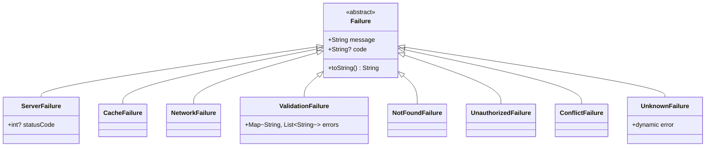

### Error Flow Diagram

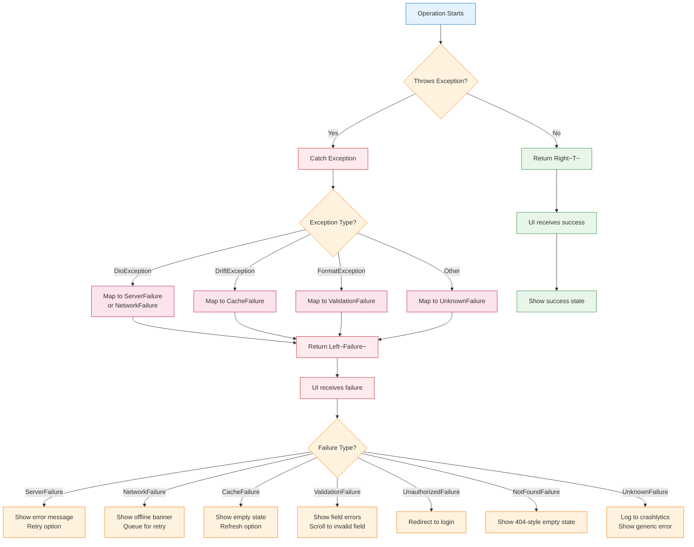

### Error Handling in Code

```dart
// Repository layer: catch and map
Future<Result<Book, Failure>> getBookById(String id) async {
  try {
    final localBook = await localDataSource.getBook(id);
    if (localBook != null) {
      return Right(mapper.toEntity(localBook));
    }
    
    final remoteBook = await remoteDataSource.getBook(id);
    await localDataSource.cacheBook(remoteBook);
    return Right(mapper.toEntity(remoteBook));
  } on DioException catch (e) {
    return Left(ServerFailure(
      message: e.message ?? 'Server error',
      statusCode: e.response?.statusCode,
    ));
  } on DriftException catch (e) {
    return Left(CacheFailure(message: e.message));
  } catch (e) {
    return Left(UnknownFailure(message: e.toString()));
  }
}

// BLoC layer: fold the result
final result = await getBookDetailsUseCase(params);

result.fold(
  (failure) => emit(BookDetailError(failure)),
  (book) => emit(BookDetailLoaded(book)),
);

// UI layer: react to failure state
BlocBuilder<BookDetailBloc, BookDetailState>(
  builder: (context, state) {
    return state.map(
      initial: (_) => const SizedBox.shrink(),
      loading: (_) => const LoadingIndicator(),
      loaded: (s) => BookContent(book: s.book),
      error: (s) => ErrorWidget(
        failure: s.failure,
        onRetry: () => context.read<BookDetailBloc>().add(BookDetailRefreshed()),
      ),
    );
  },
)
```

### Global Error Boundary

For unrecoverable errors (widget build failures, async exceptions), Quraaa uses:

1. **FlutterError.onError** — Logs framework errors to analytics.
2. **PlatformDispatcher** — Catches uncaught zone errors.
3. **ErrorWidget.builder** — Replaces the red error screen with a branded fallback UI.

---

## Offline Strategy

Quraaa is designed as an **Offline-First** application. The user should never be blocked by a lack of connectivity.

### Offline-First Principles

1. **Local database is the source of truth.** All reads come from Drift first.
2. **Remote data is a enhancement.** The API provides fresh data, but the app works without it.
3. **All writes are local-first.** User actions are persisted immediately, then synced.
4. **Sync is transparent.** Users do not manually trigger sync; it happens automatically.
5. **Conflict resolution is predictable.** Last-write-wins with server-side reconciliation for critical data.

### Sync Architecture

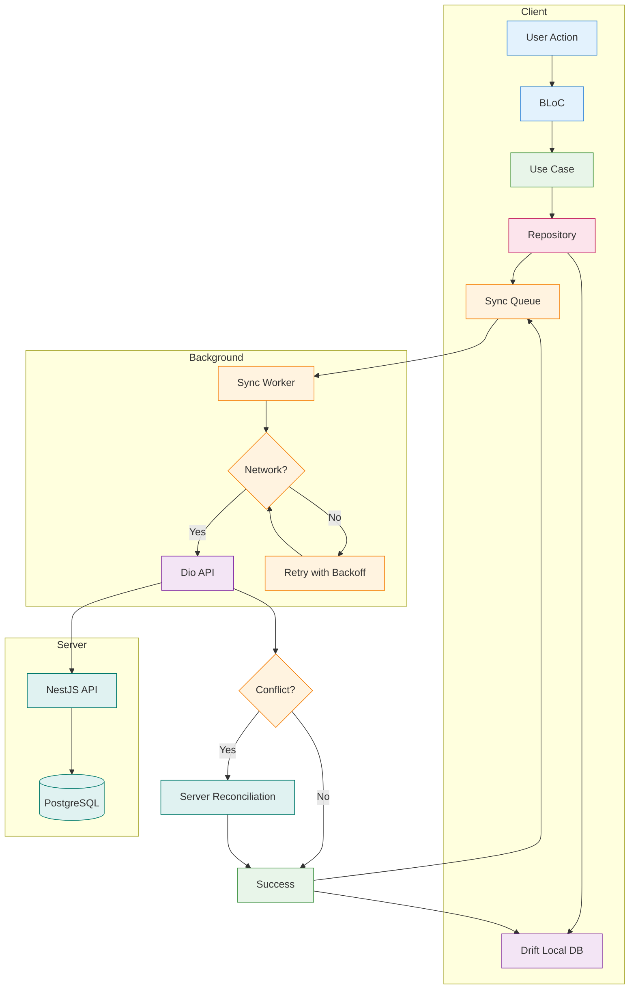

### Sync Queue

The sync queue is a persistent Drift table that stores pending operations:

| Column | Type | Description |
|--------|------|-------------|
| `id` | `String` | UUID of the operation. |
| `type` | `String` | Operation type: `create`, `update`, `delete`. |
| `entity` | `String` | Entity name: `bookmark`, `note`, `progress`. |
| `payload` | `String` | JSON-encoded operation data. |
| `status` | `String` | `pending`, `in_progress`, `completed`, `failed`. |
| `retryCount` | `int` | Number of retry attempts. |
| `createdAt` | `DateTime` | When the operation was queued. |
| `lastAttemptAt` | `DateTime?` | Last sync attempt timestamp. |

### Conflict Resolution

| Scenario | Resolution |
|----------|------------|
| **Bookmark added offline** | Server creates it on sync. No conflict. |
| **Progress updated on two devices** | Server compares timestamps. Last-write-wins. |
| **Note edited offline and online** | Server merges if possible; otherwise prompts user. |
| **Book deleted offline** | Delete propagated on sync. If already deleted on server, silently succeed. |
| **Purchase initiated offline** | Blocked immediately. Purchases require online confirmation. |

### Offline UI States

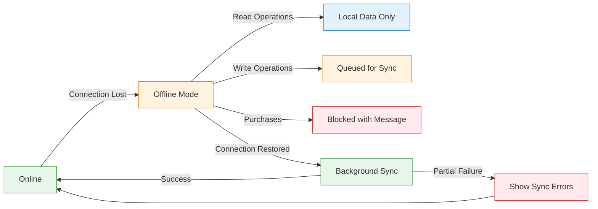

---

## Navigation Strategy

Quraaa uses **GoRouter** for declarative, URL-based navigation. This enables deep linking, web support, and predictable routing.

### Navigation Architecture

```mermaid
graph TD
    App[MaterialApp.router] --> Router[GoRouter]
    Router --> Shell[ShellRoute<br/>Bottom Navigation]
    Router --> Direct[Direct Routes]
    
    Shell --> Home[HomeBranch]
    Shell --> Library[LibraryBranch]
    Shell --> Marketplace[MarketplaceBranch]
    Shell --> Community[CommunityBranch]
    Shell --> Profile[ProfileBranch]
    
    Direct --> Book[/books/:id]
    Direct --> Reader[/reader/:id]
    Direct --> Author[/authors/:id]
    Direct --> Settings[/settings/:section]
    Direct --> Auth[/login, /register]
    
    Router --> Guards[Redirect Guards]
    Guards --> AuthGuard{Authenticated?}
    AuthGuard -->|No| Login[/login]
    AuthGuard -->|Yes| Target
    
    style App fill:#e3f2fd,stroke:#1976d2
    style Router fill:#fff3e0,stroke:#f57c00
    style Shell fill:#e8f5e9,stroke:#388e3c
    style Direct fill:#e8f5e9,stroke:#388e3c
    style Home fill:#fce4ec,stroke:#c2185b
    style Library fill:#fce4ec,stroke:#c2185b
    style Marketplace fill:#fce4ec,stroke:#c2185b
    style Community fill:#fce4ec,stroke:#c2185b
    style Profile fill:#fce4ec,stroke:#c2185b
    style Book fill:#f3e5f5,stroke:#7b1fa2
    style Reader fill:#f3e5f5,stroke:#7b1fa2
    style Author fill:#f3e5f5,stroke:#7b1fa2
    style Settings fill:#f3e5f5,stroke:#7b1fa2
    style Auth fill:#f3e5f5,stroke:#7b1fa2
    style Guards fill:#fff3e0,stroke:#f57c00
    style AuthGuard fill:#fff3e0,stroke:#f57c00
    style Login fill:#f3e5f5,stroke:#7b1fa2
    style Target fill:#e8f5e9,stroke:#388e3c
```

### Route Structure

| Route | Pattern | Description |
|-------|---------|-------------|
| Home | `/` | Dashboard with recommendations. |
| Book Detail | `/books/:id` | Book information, reviews, purchase. |
| Reader | `/reader/:id` | Full-screen reading experience. |
| Library | `/library` | User's owned books and collections. |
| Library Collection | `/library/collections/:id` | Specific shelf or collection. |
| Marketplace | `/marketplace` | Browse and search store. |
| Marketplace Category | `/marketplace/categories/:slug` | Filtered by category. |
| Author | `/authors/:id` | Author profile and bibliography. |
| Community | `/community` | Social feed and discussions. |
| Book Club | `/clubs/:id` | Club detail and discussions. |
| Profile | `/profile` | Current user's public profile. |
| Settings | `/settings` | App settings. |
| Settings Section | `/settings/:section` | Specific settings page. |
| Login | `/login` | Authentication screen. |
| Register | `/register` | Registration screen. |

### Navigation Rules

1. **No `Navigator.push` directly.** All navigation goes through GoRouter or a thin navigation service.
2. **Named routes for cross-feature navigation.** Features do not know about each other's page widgets.
3. **Auth guards on protected routes.** Unauthenticated users are redirected to `/login` with a `returnTo` parameter.
4. **Deep linking support.** Every meaningful screen has a URL that can be shared externally.
5. **State restoration.** GoRouter preserves navigation state on app restart.

### Navigation from BLoC

The BLoC should not import GoRouter. Instead, it emits a navigation event that the UI layer handles:

```dart
// BLoC emits a side effect
emit(state.copyWith(navigation: const NavigateTo('/marketplace/book/123')));

// UI listens and delegates to GoRouter
BlocListener<BookDetailBloc, BookDetailState>(
  listenWhen: (previous, current) => previous.navigation != current.navigation,
  listener: (context, state) {
    state.navigation?.when(
      navigateTo: (route) => context.go(route),
      pop: () => context.pop(),
    );
  },
)
```

---

## Best Practices

### Architecture

- **Start with the domain.** Define entities, use cases, and repository interfaces before writing any UI or data code.
- **One BLoC per screen.** Do not share BLoCs across unrelated screens. Exception: global state (auth, cart) uses a global BLoC in `core/`.
- **Pure functions in domain.** Use cases and entities should have no side effects. They take inputs and return outputs.
- **Immutability everywhere.** All entities, models, states, and events are immutable. Use `Equatable` or `freezed`.
- **Constructor injection only.** Never use `GetIt` or `locator` inside a class. Always inject dependencies via the constructor.

### Testing

- **Test the domain first.** Domain tests are the fastest and most valuable. They run in milliseconds.
- **Mock at the repository boundary.** Use `mocktail` to mock repository interfaces in use case and BLoC tests.
- **Widget tests for critical paths.** Test the full widget tree for user flows like login and purchase.
- **Golden tests for UI.** Use golden file tests to catch unintended UI regressions.
- **Integration tests for end-to-end flows.** Test login → browse → purchase → read as a full flow.

### Performance

- **Lazy loading for lists.** Use `ListView.builder` with pagination for large datasets.
- **Debounce search queries.** Wait 300ms after the user stops typing before firing search requests.
- **Cache network images.** Use `cached_network_image` with a persistent cache.
- **Minimize rebuilds.** Use `BlocBuilder` with `buildWhen` and `const` constructors aggressively.
- **Background isolates.** Heavy parsing (ePub, large JSON) runs in compute isolates.

### Security

- **No secrets in code.** Use `Envied` for API keys and sensitive configuration.
- **Secure token storage.** Access tokens and refresh tokens live in `FlutterSecureStorage`.
- **Certificate pinning.** Dio is configured with SSL certificate pinning for production.
- **Obfuscation in release.** Build with `--obfuscate --split-debug-info` for production releases.
- **Input validation.** All user input is validated in the domain layer before reaching the network.

---

## Common Mistakes

### Architecture Mistakes

| Mistake | Why It's Wrong | The Right Way |
|---------|---------------|---------------|
| **Putting Flutter in domain** | Domain layer becomes untestable without the Flutter framework. | Domain is pure Dart. No `import 'package:flutter/...'`. |
| **Calling repository from UI** | Bypasses use cases and business logic. UI becomes coupled to data details. | Always go through BLoC → Use Case → Repository. |
| **Sharing BLoCs between screens** | Creates hidden dependencies and makes state management unpredictable. | One BLoC per screen. Use global BLoCs for truly shared state. |
| **Mutable state** | Leads to bugs where state changes unexpectedly. | Use immutable classes with `copyWith` or `freezed`. |
| **Using `GetIt` inside classes** | Hides dependencies and makes testing impossible. | Inject everything via constructor parameters. |
| **Exposing models to presentation** | Presentation becomes coupled to data shape changes. | Map to entities in the repository before returning. |
| **Giant use cases** | Use cases with 5+ responsibilities are hard to test and reuse. | Split into smaller, focused use cases. |
| **Ignoring the sync queue** | Offline writes are lost when the app closes. | Every offline write goes to the sync queue immediately. |
| **Nested navigation without GoRouter** | `Navigator.push` chains become unmaintainable and break deep linking. | Use GoRouter for all navigation, including dialogs. |
| **Catching all exceptions** | `catch (e)` swallows important errors and makes debugging impossible. | Catch specific exceptions and map to typed failures. |

### Code Smells

```dart
// ❌ SMELL: Business logic in the widget
ElevatedButton(
  onPressed: () async {
    final response = await dio.get('/books/123');  // Widget knows about Dio!
    setState(() { book = response.data; });
  },
)

// ✅ CORRECT: Widget delegates to BLoC
ElevatedButton(
  onPressed: () => context.read<BookDetailBloc>().add(BookDetailOpened(id: '123')),
)
```

```dart
// ❌ SMELL: Mutable entity
class Book {
  String title;  // Mutable!
  Book({required this.title});
}

book.title = 'New Title';  // Side effect!

// ✅ CORRECT: Immutable entity
class Book extends Equatable {
  final String title;
  const Book({required this.title});
  
  Book copyWith({String? title}) => Book(title: title ?? this.title);
  
  @override
  List<Object?> get props => [title];
}
```

```dart
// ❌ SMELL: Using exceptions for control flow
try {
  await repository.getBook(id);
} catch (e) {
  if (e is NotFoundException) {
    showEmptyState();
  }
}

// ✅ CORRECT: Use Result type
final result = await repository.getBook(id);
result.fold(
  (failure) => failure is NotFoundFailure ? showEmptyState() : showError(),
  (book) => showBook(book),
);
```

---

## Related Documents

| Document | Why Read It |
|----------|-------------|
| [Clean Architecture](clean_architecture.md) | Deep dive into each layer, entities, and data mappers. |
| [Feature Architecture](feature_architecture.md) | How a single feature is structured from top to bottom. |
| [Dependency Injection](dependency_injection.md) | GetIt setup, service registration, and scoping rules. |
| [State Management](state_management.md) | BLoC patterns, event design, state machines, and Cubit usage. |
| [Navigation](navigation.md) | GoRouter configuration, deep linking, guards, and URL strategy. |
| [Offline Strategy](offline_strategy.md) | Sync workers, conflict resolution, and queue management in detail. |
| [Caching](caching.md) | Memory cache, disk cache, HTTP cache, and invalidation strategies. |
| [Error Handling](error_handling.md) | Failure classes, exception mapping, global error boundaries, and logging. |
| [Folder Structure](folder_structure.md) | Complete directory tree with file-level examples. |
| [Coding Standards](../development/coding_standards.md) | Naming conventions, style guide, and lint rules. |
| [Testing](../development/testing.md) | Unit, widget, and integration testing patterns. |

---

## Next Reading

> **Recommended:** [Clean Architecture](clean_architecture.md) — A detailed exploration of each architectural layer, with file examples and implementation patterns.

> **Alternative:** [Feature Architecture](feature_architecture.md) — See how a complete feature is built from the ground up, step by step.

> **For Setup:** [Getting Started](../development/getting_started.md) — Clone, configure, and run the project on your local machine.
