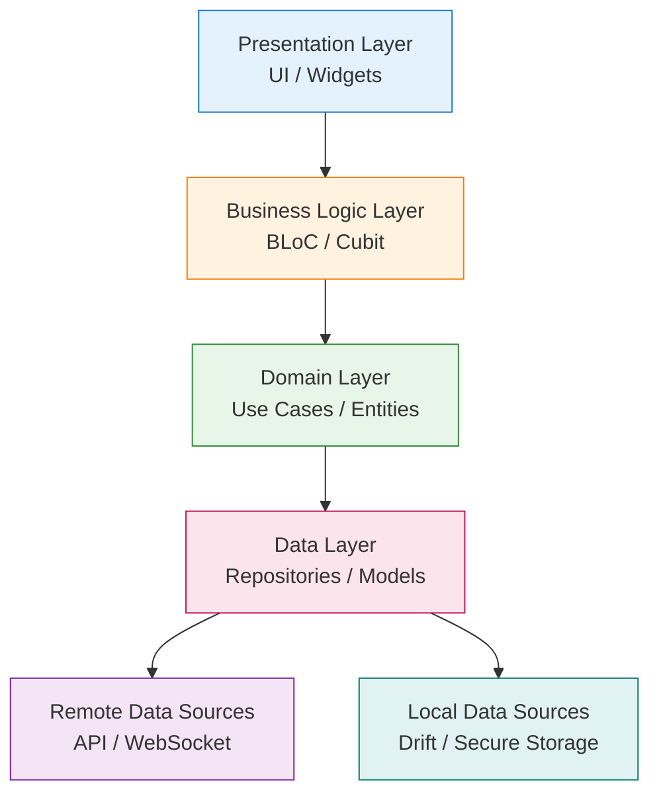
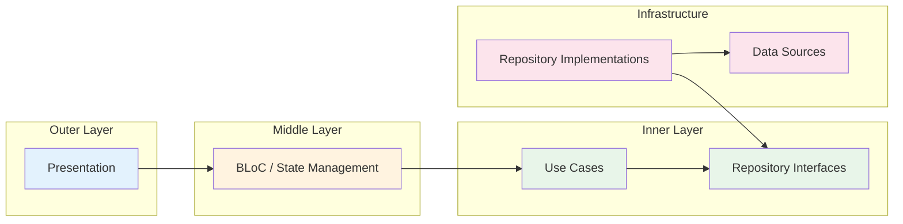
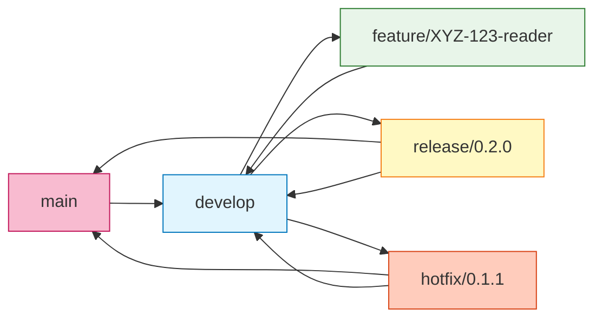

# Quraaa

<p align="center">
  <strong>Arabic Smart Reading Ecosystem</strong>
</p>

<p align="center">
  <a href="#"></a>
  <a href="#"></a>
  <a href="#"></a>
  <a href="#"></a>
  <a href="#"></a>
</p>

<p align="center">
  <a href="#"></a>
  <a href="#"></a>
  <a href="#"></a>
  <a href="#"></a>
</p>

---

## Table of Contents

- [Introduction](#introduction)
- [Vision](#vision)
- [Main Features](#main-features)
- [Technology Stack](#technology-stack)
- [Architecture Overview](#architecture-overview)
- [Folder Structure](#folder-structure)
- [Documentation Navigation](#documentation-navigation)
- [Development Workflow](#development-workflow)
- [Roadmap Summary](#roadmap-summary)
- [Contributing](#contributing)
- [License](#license)
- [Support](#support)

---

## Introduction

**Quraaa** is a modern, production-grade ecosystem designed to connect readers, authors, publishers, and bookstores across the Arabic-speaking world. It bridges the gap between digital and physical reading by providing a unified platform for discovery, purchase, consumption, and community engagement.

Built with **Flutter** for the frontend and **NestJS** for the backend, Quraaa leverages enterprise-grade architecture patterns to ensure scalability, maintainability, and testability. The application is designed with an **Offline-First** philosophy, ensuring users can read, browse, and interact regardless of network conditions.

> **Quraaa is not just a reader. It is a complete reading ecosystem.**

---

## Vision

> To become the leading Arabic reading platform by empowering readers, enabling authors, and connecting the entire book ecosystem through technology, community, and AI.

### Mission

- **For Readers:** Provide an immersive, personalized, and accessible reading experience that supports both digital and physical books, online and offline.
- **For Authors:** Offer powerful tools to publish, distribute, monitor, and engage with audiences directly.
- **For Publishers & Bookstores:** Create a seamless marketplace that drives discovery and sales across all book formats.
- **For the Community:** Build a thriving social network around reading, fostering knowledge sharing, challenges, and collective learning.

### Core Values

| Value | Description |
|-------|-------------|
| **Accessibility** | Reading should be available to everyone, everywhere, on any device. |
| **Performance** | Sub-second interactions, smooth animations, and instant content delivery. |
| **Privacy** | User data, reading habits, and notes are handled with the highest security standards. |
| **Openness** | Authors retain control; readers own their libraries and data. |
| **Innovation** | AI and smart features enhance reading without replacing it. |

---

## Main Features

<details open>
<summary><strong>📚 Marketplace</strong></summary>

| Feature | Description |
|---------|-------------|
| **Ebook Marketplace** | Purchase and manage digital books with DRM-free reading. |
| **Physical Book Marketplace** | Order physical books with integrated shipping and tracking. |
| **Used Book Exchange** | Community-driven marketplace for buying and selling pre-owned books. |

</details>

<details open>
<summary><strong>📖 Reader & Content</strong></summary>

| Feature | Description |
|---------|-------------|
| **Reader Application** | High-performance epub/pdf reader with custom typography and themes. |
| **Offline Reading** | Full content download and synchronization for offline access. |
| **Bookmarks & Highlights** | Persistent, searchable annotations synced across devices. |
| **Notes** | Rich-text notes attached to specific passages or books. |
| **Translation** | Integrated Arabic/English/Other translation services. |
| **Audiobooks** | Dedicated audio player with playback speed, sleep timer, and bookmarks. |
| **Smart Search** | Full-text search across library, store, and content. |

</details>

<details open>
<summary><strong>🤖 AI & Intelligence</strong></summary>

| Feature | Description |
|---------|-------------|
| **AI Reading Assistant** | Contextual summaries, definitions, and explanations. |
| **Reading Statistics** | Detailed analytics on reading habits, speed, and preferences. |
| **Reading Challenges** | Gamified goals and community competitions. |
| **Achievements** | Unlock milestones and rewards based on reading behavior. |

</details>

<details open>
<summary><strong>👥 Community & Social</strong></summary>

| Feature | Description |
|---------|-------------|
| **Book Clubs** | Create or join reading groups with discussion threads. |
| **Community** | Reviews, recommendations, ratings, and social feeds. |
| **Writer Dashboard** | Analytics, publishing tools, and direct reader engagement for authors. |
| **Notifications** | Smart, real-time alerts for events, messages, and updates. |
| **Subscription System** | Flexible reader plans and premium author tools. |
| **Profile** | Public reading profiles, shelves, and activity feeds. |

</details>

---

## Technology Stack

### Frontend

| Technology | Purpose | Version |
|------------|---------|---------|
| [Flutter](https://flutter.dev) | Cross-platform UI framework | `^3.19.0` |
| [Dart](https://dart.dev) | Programming language | `^3.3.0` |
| [BLoC](https://bloclibrary.dev) | State management | `^8.1.3` |
| [GetIt](https://pub.dev/packages/get_it) | Dependency injection | `^7.6.7` |
| [GoRouter](https://pub.dev/packages/go_router) | Declarative routing | `^13.1.0` |
| [Dio](https://pub.dev/packages/dio) | HTTP client | `^5.4.0` |
| [Drift](https://drift.simonbinder.eu) | Local SQLite database | `^2.15.0` |
| [Easy Localization](https://pub.dev/packages/easy_localization) | Internationalization | `^3.0.5` |
| [Flutter Secure Storage](https://pub.dev/packages/flutter_secure_storage) | Encrypted local storage | `^9.0.0` |
| [Envied](https://pub.dev/packages/envied) | Environment configuration | `^0.5.4` |

### Backend

| Technology | Purpose | Version |
|------------|---------|---------|
| [NestJS](https://nestjs.com) | Progressive Node.js framework | `^10.0.0` |
| [TypeScript](https://www.typescriptlang.org) | Typed JavaScript | `^5.3.0` |
| [PostgreSQL](https://www.postgresql.org) | Primary relational database | `^15.0` |
| [TypeORM](https://typeorm.io) | ORM for database interaction | `^0.3.0` |
| [Redis](https://redis.io) | Caching & session storage | `^7.0` |
| [WebSocket](https://docs.nestjs.com/websockets/gateways) | Real-time communication | Native |
| [JWT](https://jwt.io) | Authentication tokens | `^9.0.0` |

### Testing & Quality

| Technology | Purpose |
|------------|---------|
| `flutter_test` | Flutter widget & unit testing |
| `mocktail` | Mocking library for Dart |
| `jest` | Backend unit testing |
| `supertest` | HTTP assertion library |
| `very_good_analysis` | Dart lint rules |
| `eslint` / `prettier` | TypeScript code quality |

---

## Architecture Overview

Quraaa follows a **Feature-First Clean Architecture** with **MVVM** and **BLoC** for state management. This ensures:

- **Modularity:** Features are self-contained and independently testable.
- **Scalability:** New features can be added without touching existing code.
- **Testability:** Business logic is decoupled from UI and framework dependencies.
- **Maintainability:** Clear separation of concerns across layers.

### High-Level Architecture



### Dependency Flow

The architecture enforces the **Dependency Rule**: dependencies always point inward. The inner layers (Domain) know nothing about the outer layers (Data, Presentation).



### Key Architectural Principles

| Principle | Application |
|-----------|-------------|
| **SOLID** | Single-responsibility classes, interface segregation for repositories, dependency inversion via DI. |
| **DRY** | Shared widgets, reusable use cases, centralized error handling. |
| **KISS** | Simple, predictable state machines in BLoC; no over-engineering. |
| **YAGNI** | Features implemented only when required by product roadmap. |
| **Composition over Inheritance** | Widgets composed of smaller widgets; behavior injected via DI. |

> **Deep Dive:** [Architecture Overview](architecture/architecture.md) | [Clean Architecture](architecture/clean_architecture.md) | [Feature Architecture](architecture/feature_architecture.md)

---

## Folder Structure

The project follows a **Feature-First** organization. Every feature is a self-contained module with its own data, domain, and presentation layers.

```mermaid
graph TD
    Root[lib/] --> Core[core/]
    Root --> Features[features/]
    Root --> Config[config/]
    Root --> Main[main.dart]
    
    Core --> DI[dependency_injection/]
    Core --> Network[network/]
    Core --> Local[local_storage/]
    Core --> Utils[utils/]
    Core --> Widgets[shared_widgets/]
    Core --> Constants[constants/]
    
    Features --> Auth[authentication/]
    Features --> Home[home/]
    Features --> Reader[reader/]
    Features --> Library[library/]
    Features --> Market[marketplace/]
    Features --> Author[author/]
    Features --> Community[community/]
    Features --> Notif[notifications/]
    Features --> Profile[profile/]
    Features --> Settings[settings/]
    Features --> Sub[subscription/]
    Features --> Achieve[achievements/]
    Features --> Audio[audiobook/]
    Features --> AI[ai_assistant/]
    
    Auth --> AuthData[data/]
    Auth --> AuthDomain[domain/]
    Auth --> AuthPres[presentation/]
    
    style Root fill:#e3f2fd,stroke:#1976d2
    style Core fill:#fff3e0,stroke:#f57c00
    style Features fill:#e8f5e9,stroke:#388e3c
    style Auth fill:#fce4ec,stroke:#c2185b
```



### Structure Rules

| Rule | Description |
|------|-------------|
| **Feature Isolation** | A feature cannot import from another feature's internal folders. Only shared code from `core/` or public exports from other features are allowed. |
| **Layer Separation** | `data/` contains models, DTOs, and repositories. `domain/` contains entities, use cases, and repository interfaces. `presentation/` contains UI, BLoC, and view models. |
| **Core Only** | `core/` houses framework-level code: networking, local storage, DI setup, shared widgets, and constants. |

> **Full Structure:** [Folder Structure](architecture/folder_structure.md)

---

## Documentation Navigation

This documentation is structured as a complete, cross-linked knowledge base. Every document links to related pages for seamless navigation.

### Project

| Document | Description |
|----------|-------------|
| [Vision](project/vision.md) | Mission, values, and long-term goals. |
| [Roadmap](project/roadmap.md) | Phased development plan with milestones. |
| [Versions](project/versions.md) | Versioning strategy and release history. |
| [Features](project/features.md) | Complete feature catalog and specifications. |
| [User Roles](project/user_roles.md) | Roles, permissions, and access control matrix. |
| [Glossary](project/glossary.md) | Domain terminology and definitions. |

### Architecture

| Document | Description |
|----------|-------------|
| [Architecture Overview](architecture/architecture.md) | High-level system design and philosophy. |
| [Folder Structure](architecture/folder_structure.md) | Detailed directory layout and organization rules. |
| [Feature Architecture](architecture/feature_architecture.md) | How features are structured internally. |
| [Clean Architecture](architecture/clean_architecture.md) | Uncle Bob's Clean Architecture applied to Flutter. |
| [Dependency Injection](architecture/dependency_injection.md) | GetIt setup, service registration, and scoping. |
| [State Management](architecture/state_management.md) | BLoC patterns, state machines, and best practices. |
| [Navigation](architecture/navigation.md) | GoRouter configuration, deep linking, and guards. |
| [Offline Strategy](architecture/offline_strategy.md) | Offline-first design, sync, and conflict resolution. |
| [Caching](architecture/caching.md) | Multi-layer caching: memory, disk, and HTTP. |
| [Error Handling](architecture/error_handling.md) | Global error boundaries, reporting, and recovery. |

### Design System

| Document | Description |
|----------|-------------|
| [Colors](design_system/colors.md) | Primary, secondary, semantic, and dark-mode palettes. |
| [Typography](design_system/typography.md) | Font families, scales, and Arabic text considerations. |
| [Spacing](design_system/spacing.md) | Grid system, padding, and margin scales. |
| [Radius](design_system/radius.md) | Border radius tokens and application rules. |
| [Icons](design_system/icons.md) | Icon library, sizing, and usage guidelines. |
| [Components](design_system/components.md) | Buttons, cards, dialogs, sheets, and snackbars. |
| [Animations](design_system/animations.md) | Motion system, durations, and easing curves. |
| [Themes](design_system/themes.md) | Light theme, dark theme, and dynamic theming. |

### Development

| Document | Description |
|----------|-------------|
| [Getting Started](development/getting_started.md) | Environment setup, IDE configuration, and first run. |
| [Coding Standards](development/coding_standards.md) | Style guide, lint rules, and code quality. |
| [Naming Conventions](development/naming_conventions.md) | File, class, widget, and variable naming rules. |
| [Assets](development/assets.md) | Images, fonts, icons, and asset management. |
| [Environment](development/environment.md) | Envied configuration, secrets, and flavor management. |
| [Localization](development/localization.md) | Arabic RTL support, string management, and Easy Localization. |
| [Testing](development/testing.md) | Unit, widget, and integration testing strategies. |
| [Git Workflow](development/git_workflow.md) | Branching model, commit conventions, and PR process. |
| [Release Process](development/release_process.md) | CI/CD, versioning, build automation, and store deployment. |

### Backend Integration

| Document | Description |
|----------|-------------|
| [API Contract](backend/api_contract.md) | REST endpoints, request/response formats, and versioning. |
| [Authentication](backend/authentication.md) | JWT flow, token refresh, OAuth, and secure storage. |
| [Pagination](backend/pagination.md) | Cursor and offset pagination strategies. |
| [WebSocket](backend/websocket.md) | Real-time events, connection management, and reconnection. |
| [Error Codes](backend/error_codes.md) | Standardized error codes and handling guidelines. |

### Feature Guides

| Feature | Document | Description |
|---------|----------|-------------|
| Authentication | [authentication.md](features/authentication.md) | Login, register, forgot password, biometrics, session management. |
| Home | [home.md](features/home.md) | Dashboard, recommendations, trending, and personalized feed. |
| Reader | [reader.md](features/reader.md) | Epub rendering, themes, fonts, pagination, gestures. |
| Library | [library.md](features/library.md) | Book management, collections, shelves, and sync. |
| Marketplace | [marketplace.md](features/marketplace.md) | Browse, search, cart, checkout, and order tracking. |
| Author Dashboard | [author.md](features/author.md) | Publishing, sales analytics, royalties, and reader engagement. |
| Community | [community.md](features/community.md) | Reviews, discussions, social feed, and following. |
| Notifications | [notifications.md](features/notifications.md) | Push, in-app, and notification preferences. |
| Profile | [profile.md](features/profile.md) | User profile, public shelves, activity history. |
| Settings | [settings.md](features/settings.md) | App preferences, account, privacy, and storage. |
| Subscription | [subscription.md](features/subscription.md) | Plans, billing, trials, and premium features. |
| Achievements | [achievements.md](features/achievements.md) | Badges, milestones, leaderboards, and gamification. |
| Audiobook | [audiobook.md](features/audiobook.md) | Audio player, playlists, downloads, and playback. |
| AI Assistant | [ai.md](features/ai.md) | Summarization, Q&A, translation, and contextual help. |
| Libraries & Dependencies | [libraries.md](features/libraries.md) | Third-party package analysis and usage guidelines. |

### Architecture Decision Records (ADRs)

| ADR | Decision | Status |
|-----|----------|--------|
| [ADR-001](decisions/adr-001-clean-architecture.md) | Adopt Clean Architecture with Feature-First organization | Accepted |
| [ADR-002](decisions/adr-002-bloc.md) | Use BLoC for state management | Accepted |
| [ADR-003](decisions/adr-003-go-router.md) | Use GoRouter for navigation | Accepted |
| [ADR-004](decisions/adr-004-dio.md) | Use Dio for HTTP networking | Accepted |
| [ADR-005](decisions/adr-005-drift.md) | Use Drift for local SQLite database | Accepted |

---

## Development Workflow

### Getting Started

```bash
# 1. Clone the repository
git clone https://github.com/quraaa/quraaa-app.git
cd quraaa-app

# 2. Install dependencies
flutter pub get

# 3. Generate code (freezed, drift, envied)
dart run build_runner build --delete-conflicting-outputs

# 4. Configure environment
cp .env.example .env
# Edit .env with your API keys and endpoints

# 5. Run the app
flutter run
```

> **Full Setup:** [Getting Started](development/getting_started.md)

### Git Workflow



We follow a **GitFlow-inspired branching model**:

| Branch | Purpose | Rules |
|--------|---------|-------|
| `main` | Production releases | Only merged via release/hotfix PRs. Tagged. |
| `develop` | Integration branch | Feature PRs merge here. |
| `feature/*` | New features | Branched from `develop`. Must pass CI + code review. |
| `release/*` | Release preparation | Branched from `develop`. Only bug fixes. |
| `hotfix/*` | Production patches | Branched from `main`. Fast-tracked. |

> **Full Details:** [Git Workflow](development/git_workflow.md) | [Release Process](development/release_process.md)

---

## Roadmap Summary

### Phase 1: Foundation (Q1 2024)
- [x] Project scaffolding and architecture setup
- [x] Design system tokens and core components
- [x] Authentication system (login, register, OTP)
- [x] CI/CD pipeline and development environment
- [ ] Backend API foundation (NestJS, PostgreSQL, Auth)

### Phase 2: Core Experience (Q2 2024)
- [ ] Ebook reader with offline support
- [ ] Library management and sync
- [ ] Ebook marketplace (browse, purchase, download)
- [ ] AI Reading Assistant (summarization, Q&A)
- [ ] Notifications and user profile

### Phase 3: Ecosystem (Q3 2024)
- [ ] Physical book marketplace and used book exchange
- [ ] Audiobook player and catalog
- [ ] Community features (reviews, discussions, following)
- [ ] Book clubs and reading challenges
- [ ] Writer dashboard and publishing tools

### Phase 4: Scale (Q4 2024)
- [ ] Subscription system and premium tiers
- [ ] Advanced analytics and achievements
- [ ] Performance optimization and accessibility audit
- [ ] Multi-region deployment and CDN
- [ ] Production launch and marketing

> **Full Roadmap:** [Roadmap](project/roadmap.md) | [Versions](project/versions.md)

---

## Contributing

We welcome contributions from the team. Please follow these guidelines:

1. **Read the Documentation:** Before starting, read [Getting Started](development/getting_started.md) and [Coding Standards](development/coding_standards.md).
2. **Create an Issue:** Document the bug or feature in our project management tool.
3. **Branch from `develop`:** Use the naming convention `feature/PROJ-123-short-description`.
4. **Write Tests:** All features must include unit and widget tests. See [Testing](development/testing.md).
5. **Update Documentation:** If your change affects architecture, API, or user-facing behavior, update the relevant markdown file in `docs/`.
6. **Submit PR:** Fill out the PR template, ensure CI passes, and request review from at least one senior developer.

### Code Quality Gates

| Gate | Requirement |
|------|-------------|
| **Lint** | Zero `very_good_analysis` warnings. |
| **Tests** | Minimum 80% coverage for new code. |
| **Docs** | Public APIs and features must be documented. |
| **Review** | At least one approval from a code owner. |
| **CI** | All GitHub Actions must pass. |

> **Full Guidelines:** [Coding Standards](development/coding_standards.md) | [Testing](development/testing.md)

---

## License

Copyright © 2024 Quraaa. All rights reserved.

This project is proprietary and confidential. Unauthorized copying, distribution, or use of this codebase or documentation is strictly prohibited without express written permission from Quraaa.

---

## Support

If you have questions, need clarification, or want to propose changes to the documentation:

- **Internal Team:** Reach out on the #quraaa-dev Slack channel.
- **Documentation Issues:** Create a task in the project board with the `documentation` label.
- **Architecture Questions:** Schedule a session with the Lead Architect via the team calendar.

---

<p align="center">
  <strong>Built with passion for Arabic readers everywhere.</strong>
</p>

<p align="center">
  <a href="project/vision.md">Vision</a> •
  <a href="architecture/architecture.md">Architecture</a> •
  <a href="development/getting_started.md">Getting Started</a> •
  <a href="project/roadmap.md">Roadmap</a> •
  <a href="features/libraries.md">Libraries</a>
</p>
